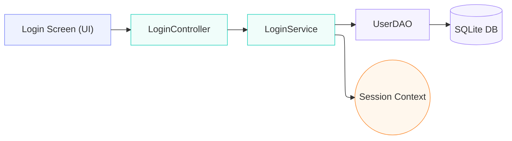
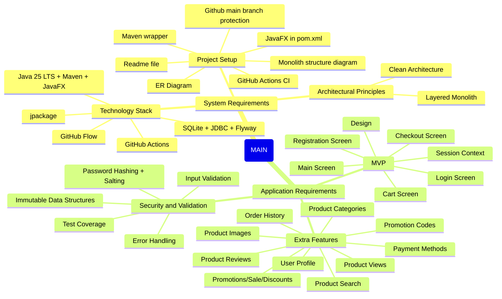

# Achitectural Diagrams

> This document contains the architectural diagrams of the project. It is intended to provide a visual representation of the architecture and design of the project. It is not meant to be a detailed technical document, but rather a high-level overview of the architecture and design decisions made during the development of the project.

## Mermaid Diagrams

1. Simple Application Flow Diagram
   - This diagram illustrates the flow of the application, showing how the different layers (UI, Controller, Service, DAO, Model) interact with each other and with the database.



2. Checklist Mind Map Diagram
   - This diagram represents the checklist of architectural and design considerations that were taken into account during the development of the project. It serves as a reminder of the key principles and best practices that guided the architectural decisions.



3. ERD Diagram v1
   - This diagram shows the Entity-Relationship Diagram (ERD) of the database schema, illustrating the tables, their attributes, and the relationships between them.

```sql
Table users {
  user_id integer [primary key, increment]
  username varchar(50) [not null, unique]
  password varchar(50) [not null] // Plain text for now
}

Table products {
  product_id integer [primary key, increment]
  name varchar(100) [not null]
  description text
  price integer [not null]
  stock_quantity integer [default: 10]
}

Table cart_items {
  id integer [primary key, increment]
  user_id integer [ref: > users.user_id]
  product_id integer [ref: > products.product_id]
  quantity integer [default: 1]

  indexes {
    (user_id, product_id) [unique]
  }
}
```
